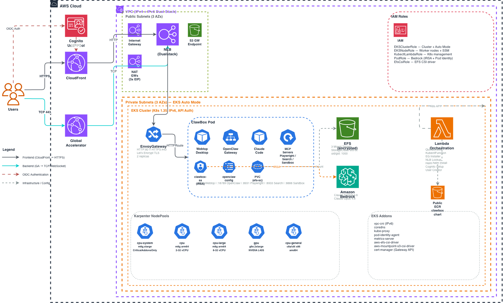

# ClawBox

A cloud-native OpenClaw environment on AWS — one-click deploy via CloudFormation.

### Deploy

[](https://console.aws.amazon.com/cloudformation/home#/stacks/new)

1. Download [`CloudFormation.yaml`](https://raw.githubusercontent.com/aws300/clawbox/main/scripts/CloudFormation.yaml)
2. Open the [AWS CloudFormation Console](https://console.aws.amazon.com/cloudformation/home#/stacks/new) → **Create stack** → **Upload a template file**
3. Upload the downloaded YAML file, then follow the wizard to create the stack

> **Note:** CloudFormation's `templateURL` parameter only accepts S3 URLs, so the template must be uploaded manually.

> **Tip:** Deploy in a fresh region to avoid hitting the default Elastic IP quota (5 per region). A region with no existing workloads ensures sufficient capacity.

---

## Architecture Overview

The CloudFormation stack provisions a complete production-grade infrastructure in a single deployment (~25 minutes). The architecture uses a **dual-path** design: CloudFront for frontend access (HTTPS with caching) and Global Accelerator for backend access (TCP direct for WebSocket/streaming).



### What Gets Created

| Layer | Resources |
|---|---|
| **Pre-flight** | Lambda quota checker (EIP, VPC, NAT GW, m8g availability, naming conflicts) |
| **Networking** | VPC (IPv4+IPv6 dual-stack), 3 AZ × (Public + Private subnets), 3 NAT Gateways with EIPs, IGW, Egress-Only IGW, S3 Gateway Endpoint |
| **IAM** | 5 roles — EKSClusterRole, EKSNodeRole, KubectlLambdaRole, PodRole (Bedrock IRSA), EfsCsiRole |
| **EKS** | Cluster (Auto Mode, IPv6, API auth), OIDC Provider |
| **EKS Addons** | vpc-cni, coredns, kube-proxy, pod-identity-agent, metrics-server, efs-csi-driver, s3-csi-driver, cert-manager |
| **Storage** | EFS (encrypted, 3 mount targets), StorageClass `efs-sc` (uid/gid 1000) |
| **Compute** | 5 Karpenter NodePools — cpu-system (m8g.xlarge), cpu (m8g arm64), cpu-large (m8g 8-32 vCPU), gpu (g6e.2xlarge NVIDIA), cpu-general (c8a/c8i x86) |
| **Ingress** | EnvoyGateway (auto-installed from release), GatewayClass, Gateway (HTTP:80 + HTTPS:443), Let's Encrypt auto-TLS via cert-manager |
| **CDN** | CloudFront distribution (assets 30d cache, HTML 1h, auth no-cache, security headers, X-CloudFront-Secret origin verification) |
| **Acceleration** | Global Accelerator (dual-stack, TCP 80+443) → NLB → EnvoyGateway |
| **Auth** | Cognito User Pool + OIDC client + auto-created admin user |
| **Orchestration** | 7 Lambda functions (QuotaCheck, Kubectl, EG-Installer, NLB-Lookup, Helm-Deploy, Cognito-Setup, User-Creator) |
| **App** | ClawBox Helm chart deployed from `oci://public.ecr.aws/b1y9i2f3/clawbox` |

### Dual-Path Access Architecture

```
                           ┌─────────────┐
                      HTTPS│  CloudFront  │── Cache (assets 30d, HTML 1h)
           ┌──────────────►│  (Frontend)  │
           │               └──────┬───────┘
           │                      │ HTTP (X-CloudFront-Secret)
 ┌──────┐  │               ┌──────▼───────┐     ┌──────────────┐     ┌──────────────┐
 │ User │──┤               │     NLB      │────►│ EnvoyGateway │────►│ ClawBox Pod  │
 └──────┘  │               │  (Dualstack)  │     │  (HTTP/HTTPS) │     │              │
           │               └──────▲───────┘     └──────────────┘     │ Webtop :3000 │
           │                      │ TCP 443                          │ OpenClaw:18789│
           │  TCP   ┌─────────────┴──┐                               │ Claude Code   │
           └───────►│    Global      │── Direct (WebSocket/Stream)   │ MCP Servers   │
                    │  Accelerator   │                               │ EFS Storage   │
                    └────────────────┘                               └───────┬──────┘
                                                                            │ IRSA
           ┌──────────┐                                             ┌───────▼──────┐
           │ Cognito   │◄─── OIDC code flow ──────────────────────►│   Bedrock    │
           │ User Pool │    (callback: CF + GA domains)             │ Sonnet / Opus│
           └──────────┘                                             └──────────────┘
```

- **CloudFront path** — HTTPS with edge caching, security headers (HSTS, XSS protection), redirect HTTP→HTTPS. Used for the Webtop desktop UI and static assets.
- **Global Accelerator path** — TCP passthrough on port 443, no caching. Used for OpenClaw Gateway WebSocket/streaming connections that require persistent connections.
- **Cognito OIDC** — Both CloudFront and GA domains are registered as callback URLs. Authentication is enforced at the application layer.

### ClawBox Pod

The pod runs as a single container with co-located services:

| Port | Service | Description |
|---|---|---|
| 3000 | Webtop (Selkies/nginx) | XFCE desktop via browser streaming |
| 18789 | OpenClaw Gateway | AI agent orchestration gateway |
| 18790 | OpenClaw Bridge | Real-time bridge service |
| 8931 | Playwright MCP | Browser automation (SSE) |
| 8933 | Google Search MCP | Web search (HTTP) |
| 8888 | Sandbox MCP | Code execution sandbox |

All services share the same EFS-backed persistent storage (`/home/core/Workspace`), so work survives pod restarts.

### Karpenter NodePools

| Pool | Instance | Arch | Taint | Use Case |
|---|---|---|---|---|
| `cpu-system` | m8g.xlarge | arm64 | CriticalAddonsOnly | System addons (CoreDNS, kube-proxy) |
| `cpu` | m8g (2-32 vCPU) | arm64 | — | General workloads, ClawBox pods |
| `cpu-large` | m8g (8-32 vCPU) | arm64 | size=large | Memory-intensive workloads |
| `gpu` | g6e.2xlarge | amd64 | nvidia.com/gpu | GPU inference (NVIDIA L40S) |
| `cpu-general` | c8a/c8i | amd64 | arch=x86_64 | x86-only workloads |

### Security

- **Zero long-lived credentials** — IRSA mounts a short-lived web identity token; STS exchanges it for temporary Bedrock-scoped credentials
- **Minimal IAM surface** — PodRole holds exactly three permissions: `bedrock:InvokeModel`, `bedrock:InvokeModelWithResponseStream`, `bedrock:ListFoundationModels`
- **Origin verification** — CloudFront injects `X-CloudFront-Secret` header; only requests from the distribution reach the origin
- **Auto TLS** — cert-manager + Let's Encrypt issue certificates automatically for NLB and GA hostnames via HTTP-01 challenge
- **Cognito OIDC** — User authentication via OpenID Connect code flow; admin user auto-created at stack time
- **IPv6 dual-stack** — Full IPv6 support across VPC, EKS, and load balancers
- **Public ECR** — Container image served from public ECR; no credentials needed to pull
- **GitHub OIDC** — CI/CD uses GitHub's OIDC provider to assume `GithubActionsRole`; no AWS access keys in GitHub secrets

### AWS Graviton

ClawBox is built as a multi-arch image (`linux/amd64`, `linux/arm64`). Running on Graviton (m8g nodes) provides:

- Up to 40% better price/performance vs. x86 for long-running AI workloads
- Native ARM execution — no emulation overhead for the Claude Code process
- Lower per-hour cost for the 4 GiB RAM / 2 vCPU baseline request

### Development Workflow

```
git push main      →  GitHub Actions  →  helm upgrade (EKS)  →  live in ~60s
git tag docker-*   →  GitHub Actions  →  docker build        →  ECR push
```

Two separate pipelines keep application config changes (Helm values) decoupled from container image changes. Rollback is a single `helm rollback` command.

---

## Quick Start

After the CloudFormation stack reaches **CREATE_COMPLETE**, open the **Outputs** tab in the CloudFormation console:

1. **Open ClawBox** — Copy the `CloudFrontDomain` value and open `https://<CloudFrontDomain>` in your browser.
2. **Login** — Use the credentials from the Outputs tab:
   - **Username**: `CognitoAdminUsername` (default `admin@cnf.local`)
   - **Password**: `CognitoAdminPassword` (auto-generated, shown only once — save it immediately)

> The admin password is generated at stack creation time and displayed only in the Outputs tab. If you lose it, delete and recreate the stack or reset the password via the Cognito console.

### Stack Outputs

| Output | Description |
|---|---|
| `CloudFrontDomain` | Frontend URL (Webtop desktop) |
| `GlobalAcceleratorHost` | Backend URL (OpenClaw Gateway, WebSocket) |
| `EksClusterName` | EKS cluster name for `kubectl` access |
| `EfsFileSystemId` | EFS file system ID for persistent storage |
| `CognitoAdminUsername` | Admin login email |
| `CognitoAdminPassword` | Admin password (save immediately) |
| `CognitoUserPoolId` | Cognito User Pool ID |
| `PodRoleArn` | IAM role ARN for pod Bedrock access |
| `NlbDns` | NLB DNS for direct access |

---

## Docs

- [AWS IRSA Setup](docs/aws-irsa-setup.md) — Create the Bedrock IAM role and deploy with Helm
- [AWS CI/CD Setup](docs/aws-cicd-setup.md) — Configure GithubActionsRole and GitHub workflows
- [Feishu Bot Setup](docs/feishu-setup.md) — Connect OpenClaw to Feishu/Lark messaging
- [Manual Install](docs/install_clawbox.md) — Deploy ClawBox without CloudFormation
- [Architecture Diagram](docs/architecture.drawio) — Full system diagram (open in draw.io)
